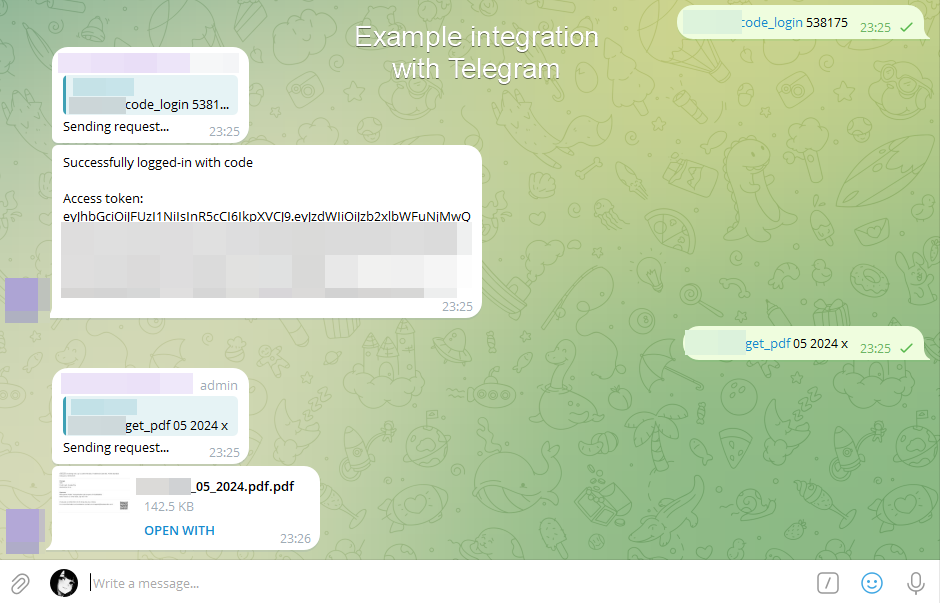

# RavKav-Export-PDF
_Alpha release_

### Idea:
Every month, I spend a considerable amount of time manually opening Rav-Kav receipts and saving each one as a PDF. Afterward, I need to merge all these PDFs into a single file. This process is time-consuming and tedious.

To streamline this workflow, I've created an automation tool. With this tool, you simply need to provide the month and year, and it will automatically generate a consolidated PDF containing all your receipts for that period.

This automation saves time and effort, making it easier to manage and store your Rav-Kav receipts efficiently.



---

### Before you start, Make sure to add your username & password to the .env file

---

#### This document describes the steps required to interact with this script to perform various actions such as logging in, sending verification codes, logging in with a code, retrieving PDF reports, and deleting generated PDFs.

## 1. Login
This endpoint performs a normal login to the RavKav Online system.

```text
IP:PORT/login
```

Use this endpoint to log in with your credentials. This step is required to authenticate yourself before performing other actions.

**This step returns access_token, which is required for step 4**

---

## 2. Send Verification Code (Optional)

If the login step (step 1) returns verification_required, you need to send a verification code to your registered contact information.

```text
IP:PORT/send_verification_code
```

This endpoint sends a verification code to you. This step is necessary if additional verification is required after the initial login attempt.

---

## 3. Login with Code (Optional)

After sending the verification code (step 2), you need to log in using the code you received.


```text
IP:PORT/login_with_code <CODE>
```

Use this endpoint to log in with the verification code that was sent to you.

Replace `<CODE>` with the actual code you received. This step completes the login process if additional verification was needed.

**This step returns access_token, which is required for step 4**

---

## 4. Get PDF

Once you are logged in, you can retrieve a PDF report for a specific month and year.

```text
IP:PORT/get_pdfs <MONTH> <YEAR> <ACCESS_TOKEN_FROM_LOGIN_STEP>
```

Example
```text
IP:PORT/get_pdfs 05 2024 132
```

Use this endpoint to get a PDF report for a specified month and year. Replace <MONTH>, <YEAR>, and <ACCESS_TOKEN> with the appropriate values. The access token is obtained from the login step.

---

## 5. Get XLSX

Once you are logged in, you can retrieve a XLSX report for a specific month and year.

```text
IP:PORT/get_sheet <MONTH> <YEAR> <ACCESS_TOKEN_FROM_LOGIN_STEP>
```

Example
```text
IP:PORT/get_sheet 05 2024 132
```

Use this endpoint to get a PDF report for a specified month and year. Replace <MONTH>, <YEAR>, and <ACCESS_TOKEN> with the appropriate values. The access token is obtained from the login step.

---

## 6. Delete PDFs

After retrieving the PDF, make sure to delete the generated files to manage storage and privacy.

```text
IP:PORT/delete_pdfs
```

This endpoint deletes the generated PDF files. It is a good practice to delete files that are no longer needed to maintain storage hygiene and ensure privacy.